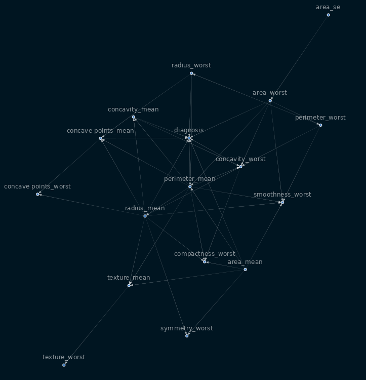

# implementing machine learing using causal inference
Causal inference which is the process of understanding the independent, actual effect of a certain phenomenon that is happening within a larger system. which is quite different from the normal machine learing approach

## Table of contents
* [General info](#general-info)
* [Screenshots](#screenshots)
* [Technologies](#technologies)
* [Setup](#setup)
* [Features](#features)
* [Status](#status)
* [Inspiration](#inspiration)
* [Contact](#contact)

## General info
A common frustration in the industry, especially when it comes to getting business insights from tabular data, is that the most interesting questions (from their perspective) are often not answerable with observational data alone. These questions can be similar to:
- “What will happen if I halve the price of my product?”
- “Which clients will pay their debts only if I call them?”

the following tasks has been done on the Breas cancer dataset found on kaggle
- Perform a causal inference task using Pearl’s framework;
- Infer the causal graph from observational data and then validate the graph;
- Merge machine learning with causal inference;?

## Screenshots

## Technologies
- dvc
- CI/CD

## Setup
`git clone ` 
`pip install -r requirements.txt`
`python scripts/train.py`

## Code Examples
`from causal import Causal`
`sm = Causal.plt_structure(df,  frac=1, parent_node='diagnosis')`

## Features
* an easy to use class to replicate for similar tasks

To-do list:
* make it an end to end workflow
* adding GUI so users (especially domain experts) can interact with it
* able to work for any dataset

## Status
Project is: _in progress_, 

## Inspiration
Add here credits. Project inspired by..., based on...

## Contact
Created by [@sam23121]- feel free to contact me!